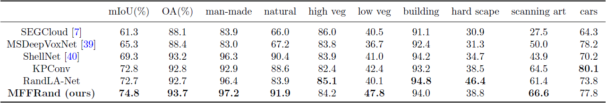
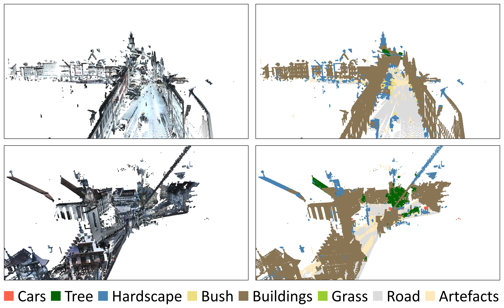

# MFFRand: Semantic Segmentation of Point Clouds Based on Multi-Scale Feature Fusion and Multi-Loss Supervision

This is the official implementation of MFFRand, a neural architecture for semantic segmentation of 3D point clouds. For technical details, please refer to:

**MFFRand: Semantic Segmentation of Point Clouds Based on Multi-Scale Feature Fusion and Multi-Loss Supervision** 

Pan Tang, Shaojing Song, Zhiqing Miao, Jian Chen, Jinyan Hu, Yumei Gong

### (1) Setup
This code has been tested with Python 3.5, Tensorflow 1.11, CUDA 9.0 and cuDNN 7.4.1 on Ubuntu 18.04.

- Clone the repository 
```
git clone --depth=1 https://github.com/tangpan360/MFFRand.git && cd MFFRand
```
- Setup python environment
```
conda create -n mffrand python=3.5
source activate mffrand
pip install -r helper_requirements.txt
sh compile_op.sh
```

### (2) Semantic3D
7zip is required to uncompress the raw data in this dataset, to install p7zip:

```
sudo apt-get install p7zip-full
```
- Download and extract the dataset. First, please specify the path of the dataset by changing the `BASE_DIR` in "download_semantic3d.sh"    
```
sh utils/download_semantic3d.sh
```
- Preparing the dataset:
```
python utils/data_prepare_semantic3d.py
```
- Start training:
```
python main_Semantic3D.py --mode train --gpu 0
```
- Evaluation:
```
python main_Semantic3D.py --mode test --gpu 0
```
Quantitative results of different approaches on Semantic3D (reduced-8):



Visualization of partial prediction results of Semantic3D (reduced-8):



**Note:** 

- Preferably with more than 64G RAM to process this dataset due to the large volume of point cloud.


### Acknowledgment
-  Part of our code refers to the recent work <a href="https://github.com/QingyongHu/RandLA-Net">RandLA-Net</a>.


